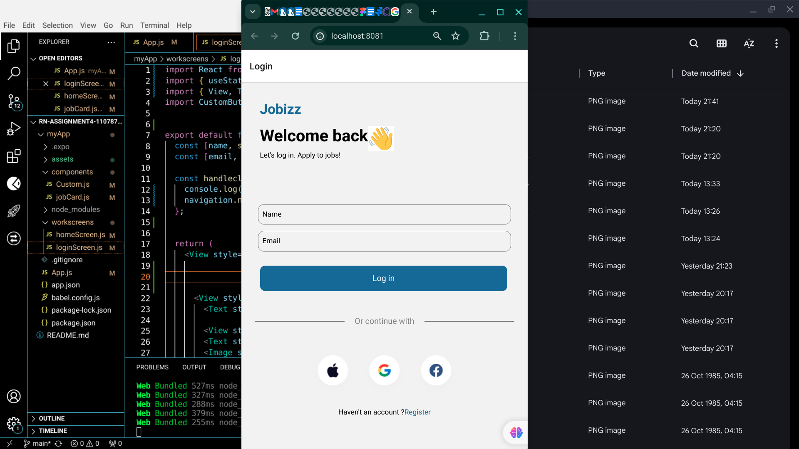
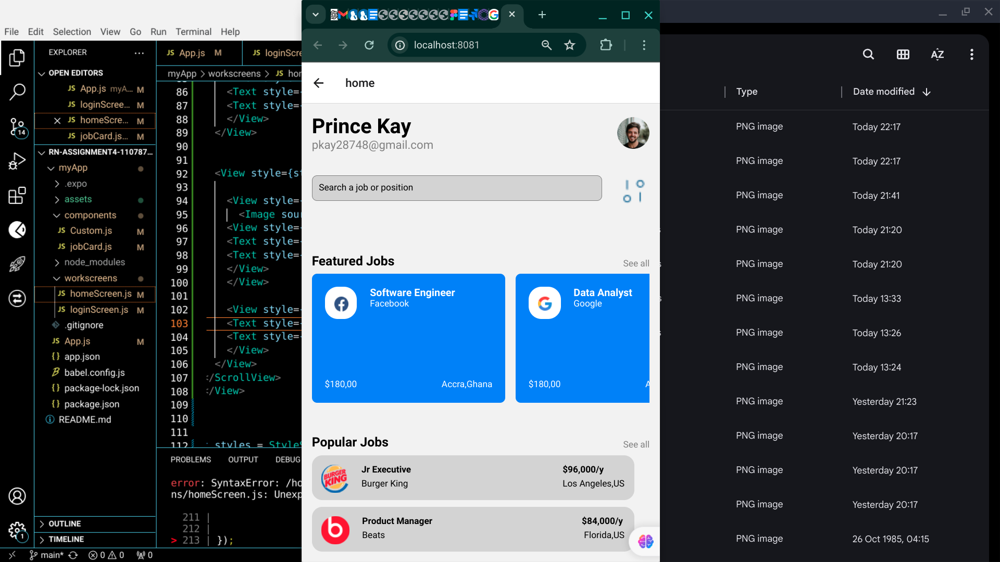

# rn-assignment4-11078728

# Job Application Mobile App
This is a mobile application app built using React Native for job searching and applying.The app allows users to log in,view popular and featured jobs and navigate through the application.

# Table of Contents
Features
Getting Started
Prerequisites
Installation
Project Structure
Usage
Running on Web
Running on Android/iOS
Components
Screens
Login Screen
Home Screen
Adding Screenshots
Contributing
License
Features
User login functionality
Display of popular and featured jobs
Horizontal scrolling for popular jobs
Responsive design for different screen sizes
Getting Started
Prerequisites
Before you begin, ensure you have met the following requirements:

You have installed Node.js and npm.
You have installed Expo CLI.

# Installation
a. Clone the repository: 
git clone https://github.com/pkay28748/rn-assignment4-11078728.git
 cd job-app

b. Install the dependencies: npm install

c. Start the expo server: npx expo start

# Project Structure 
job-app/
├── assets/
│   ├── icon.png
│   ├── waaavy.png
│   ├── g54.png
│   ├── g55.png
│   └── g56.png and all other necessary icons for the project.
├── components/
│   ├── CustomButton.js
│   ├── JobCard.js
├── workscreens/
│   ├── LoginScreen.js
│   └── HomeScreen.js
├── App.js
├── package.json
└── README.md

# Usage
a. Start the expo server:
npm run web /npm run ios / npm run android

# Components

CustomButton
A custom button component used for the login button.

JobCard
A component used to display job details in a card format.

Screens
Login Screen
The login screen allows users to input their name and email to log in. It includes a styled login button and additional UI elements for user interaction.

Home Screen
The home screen displays the user's name and email, a list of popular jobs in a horizontal scroll view, and featured jobs in a flatlist.

# Screenshot
### Login Screen

### Home Screen

# Contributing
Contributions are welcome! Please feel free to submit a Pull Request.

# License
This project is licensed under the MIT License - see the LICENSE file for details.
